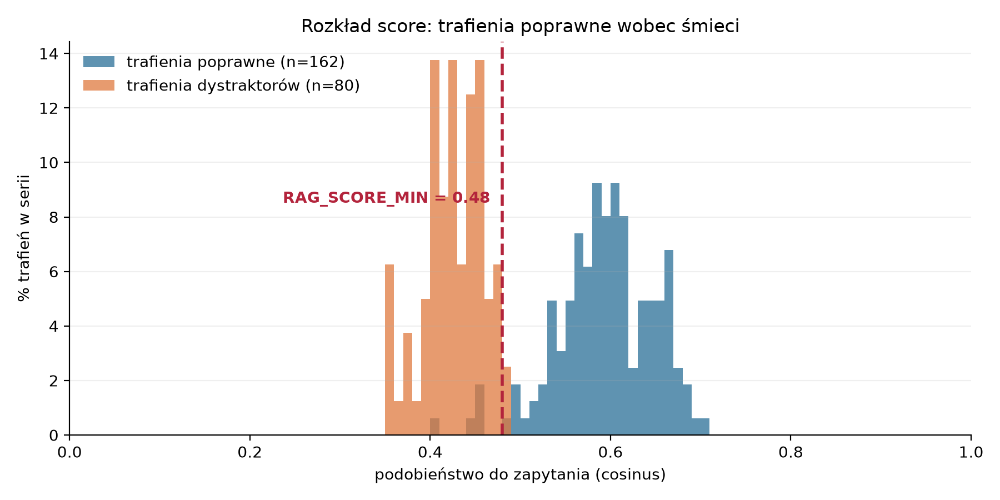

# Pomiar progu `RAG_SCORE_MIN` (podkrok 5.7)

**Data:** 2026-08-20  
**Model:** `OPI-PIB/PolDense-150M`, tryb `query→passage`  
**Wynik: `RAG_SCORE_MIN = 0.48`.**

---

## Wstęp

**Zakończyliśmy implementację wyszukiwania.** Aplikacja potrafi przyjąć nowe zgłoszenie i znaleźć
w bazie wiedzy podobne sprawy z przeszłości wraz z ich rozwiązaniami. Działa to przez API
(`POST /search`) oraz z konsoli (`helpdesk rag search`).

Przebieg jest trzyetapowy: model językowy czyta treść zgłoszenia i sprowadza je do zwięzłego opisu
problemu → opis zamieniany jest na wektor → baza wektorowa zwraca najbardziej podobne rekordy
historyczne, każdy z miarą podobieństwa.

Przykładowe zapytanie — treść zgłoszenia tak, jak napisał ją użytkownik, wraz z komentarzami, które
zdążyły już narosnąć w wątku:

```json
POST /search

{
  "ticket_id": "41002",
  "subject": "Błąd podpisu ePUAP",
  "body": "Dzień dobry, nie mogę podpisać pisma, które ma iść przez ePUAP. Przy próbie podpisu wyskakuje błąd: Błąd wykonania podpisu: The entity 'oacute' was referenced, but not declared. Wcześniej to działało. Proszę o pomoc.",
  "comments": [
    {
      "role": "konsultant",
      "created_at": "2026-08-20 09:14:02",
      "body": "Czy błąd występuje przy każdym piśmie, czy tylko przy tym jednym?"
    },
    {
      "role": "klient",
      "created_at": "2026-08-20 10:02:47",
      "body": "Sprawdziłam na trzech pismach — przy każdym to samo. Inni pracownicy też zgłaszają."
    }
  ]
}
```

Komentarze są opcjonalne, ale warto je przekazać: stan rozmowy bywa istotniejszy niż sam opis
początkowy — dostawca potrafi odwołać własną pierwszą diagnozę, a najcenniejsze ustalenie pada
często w ostatnim komentarzu.

Odpowiedź:

```json
{
  "query": {
    "component": "usługa ePUAP",
    "problem": "Nie można podpisać pisma przez ePUAP z powodu błędu podpisu.",
    "symptoms": "Błąd wykonania podpisu: The entity 'oacute' was referenced, but not declared.",
    "error_codes": ["The entity 'oacute' was referenced, but not declared"]
  },
  "hits": [
    {
      "ticket_id": "5641",
      "score": 0.649,
      "date": "2022-01-13",
      "problem": "Brak możliwości tworzenia paczki e-puap oraz podpisu i wysyłki e-puap",
      "cause": "Brak ustalonej przyczyny w wątku",
      "solution": "Wprowadzono poprawkę. Proszę spróbować wykonać paczka ePUAP + podpis elektroniczny.",
      "resolution": "naprawione"
    },
    ...
  ],
  "dropped_below_threshold": 0
}
```

## Po co ten pomiar

Przy wyszukiwaniu podajemy Qdrantowi, ile trafień maksymalnie chcemy dostać — u nas pięć
(`RAG_TOP_K`). Baza **zawsze** odda tyle rekordów, ile ma, nawet gdy żaden nie pasuje: zwraca
pięć najbliższych, a nie pięć trafnych. Każdy wynik ma miarę podobieństwa do zapytania, np. 0,11,
0,34, 0,45.

Trzeba więc zdecydować, **poniżej jakiej wartości wynik jest śmieciem, a powyżej — prawdziwym
dopasowaniem**. Tę granicę wyznacza `RAG_SCORE_MIN`. Po to jest ten pomiar.

Stawka jest dwustronna: próg za niski przepuszcza śmieci, które **wyglądają na odpowiedź**; próg
za wysoki wycina trafienia poprawne.

## Jak wykonano pomiar

Pomiar wykonano z użyciem dwóch grup zapytań:

| lp. | nazwa | liczba | plik |
|---:|---|---:|---|
| 1 | zapytania z golden setu | 162 | `data/golden/bielik-11b-golden200.json` |
| 2 | dystraktory | 16 | `data/golden/distractors.json` |

**Grupa 1** to prawdziwe sparsowane tickety, dla których wygenerowano teoretyczne pytania — takie,
jakie zadałby zgłaszający, gdyby trafił na ten sam problem. Każde ma więc swój rekord w bazie
i pokazuje, jakie podobieństwo osiągamy przy trafieniu poprawnym, czyli czego nie wolno odciąć
progiem.

**Grupa 2** to zapytania, dla których poprawną odpowiedzią jest **brak trafień**. Powstały
w trzech klasach:

| lp. | klasa | liczba | opis |
|---:|---|---:|---|
| 1 | spoza modułu | 6 | Wymyślone pytania spoza dziedziny Dokusa — do innych aplikacji dostawcy: Karty Kontowe, KiP, Podatki, FK, Portal inwestora, eObywatel. |
| 2 | odsiane z indeksu | 5 | Zgłoszenia wycięte przez nasz filtr jakości przy imporcie, bo LLM nie wyznaczył dla nich rozwiązania, np. „omówione telefonicznie". |
| 3 | nieobecne w bazie | 5 | Wymyślone pytania z dziedziny Dokusa, dobrane tak, by nie miały odpowiednika w tych 171 rekordach — wiarygodne zgłoszenia, na które baza nie ma odpowiedzi. |

## Wyniki

Obie serie tworzą osobne skupiska: śmieci mieszczą się w paśmie 0,35–0,49, trafienia poprawne
zaczynają się od 0,53 i sięgają 0,70. Ogony stykają się między 0,41 a 0,49 — leżą tam cztery
trafienia poprawne ze 162 i niemal wszystkie dystraktory.



**To, że krańce się stykają, nie znaczy, że progu nie da się ustawić** — znaczy tylko, że nie ma
progu bezkosztowego. Rozstrzyga gęstość, nie zasięg: kreska na 0,48 pada w dolinę między
skupiskami, zostawiając po prawej niemal całą serię niebieską i odcinając niemal całą pomarańczową.

Ile dokładnie kosztuje każde miejsce cięcia:

| próg | poprawne zachowane (z 162) | dystraktory wyciszone (z 16) | trafienia odcięte (z 80) |
|---:|---:|---:|---:|
| 0,40 | 162 — 100,0% | 1 — 6,2% | 17,5% |
| 0,42 | 161 — 99,4% | 5 — 31,2% | 40,0% |
| 0,44 | 161 — 99,4% | 8 — 50,0% | 60,0% |
| 0,46 | 157 — 96,9% | 11 — 68,8% | 86,2% |
| **0,48** | **157 — 96,9%** | **14 — 87,5%** | **97,5%** |
| 0,50 | 153 — 94,4% | 16 — 100,0% | 100,0% |
| 0,54 | 139 — 85,8% | 16 — 100,0% | 100,0% |

**Dwie miary po stronie dystraktorów mierzą co innego i nie wolno ich mylić:**

- **zapytania wyciszone całkiem** — ile dystraktorów nie zwróciło **ani jednego** trafienia nad
  progiem. To jest rezultat: użytkownik dostaje uczciwą pustkę.
- **trafienia odcięte** — ile pojedynczych trafień wypadło w sumie. To jest postęp, nie rezultat:
  dystraktor skrócony z pięciu śmieci do jednego dalej wygląda jak odpowiedź.

## Przykład

Jak próg 0,48 działa na dwóch skrajnych przypadkach.

### Zapytanie, które ma odpowiedź w bazie

> Przestały zapisywać się skany — działa wybiórczo. Przy skanowaniu około trzydziestu stron nic
> nie dociera do systemu.

| score | ticket | `problem` rekordu | próg 0,48 |
|---:|---:|---|---|
| **0,554** | 22696 | Przestało działać zapisywanie skanów w eSOD. Skan działa wybiórczo. | **przechodzi** |
| 0,493 | 26300 | Skaner nie dołącza dokumentów do systemu, brak komunikatu błędu. | **przechodzi** |
| 0,467 | 22586 | Skany wielostronicowe nie zapisują się. | odcięte |
| 0,453 | 28112 | Błąd połączenia z serwerem. | odcięte |
| 0,453 | 17476 | Przy tworzeniu pisma przestało wyskakiwać okienko wyboru osoby… | odcięte |

**Decyzja: dwa trafienia trafiają do promptu, trzy odpadają.** Rekord właściwy stoi na pierwszym
miejscu z wyraźnym zapasem nad progiem.

### Zapytanie, które odpowiedzi w bazie nie ma

Dystraktor D03 — zgłoszenie do modułu Podatki, czyli innej aplikacji:

> Proszę o pomoc w wydruku decyzji o wymiarze podatku rolnego — nie zaciąga się powierzchnia
> użytków z ewidencji gruntów.

| score | ticket | `problem` rekordu | próg 0,48 |
|---:|---:|---|---|
| 0,439 | 26455 | Brak automatycznego wstawiania daty doręczenia decyzji podatkowych… | odcięte |
| 0,433 | 7864 | Raporty nie generują się po dacie rejestracji i Pierwszym Dekretującym… | odcięte |
| 0,431 | 8765 | Błąd w treści formularza WNIOSEK o wydanie zaświadczenia o niezaleganiu… | odcięte |
| 0,428 | 19863 | Brak informacji w metryce dokumentu o tym, kto zlecił eksport… | odcięte |
| 0,425 | 24376 | Brak wizualizacji UPP w dokumencie. | odcięte |

**Decyzja: pusta lista, „nowy typ problemu".** I o to chodzi — bez progu wdrożeniowiec zobaczyłby
tu pięć rekordów, a pierwszy z nich mówi o **decyzjach podatkowych**, więc wygląda wiarygodnie.
Trafienie bez związku ze sprawą jest gorsze niż brak trafienia, bo wygląda na odpowiedź.

## Jak powtórzyć

### 1. Przygotowanie

```bash
docker compose up -d
helpdesk rag index data/parsed/bielik-11b-golden200
```

Oba pomiary idą przez usługę embeddera i Qdranta, czyli tę samą drogę co produkcja. Bez kolekcji
skrypt kończy się kodem 2 i mówi, czego brakuje — zamiast drukować raport zer.

### 2. Tabela koszt/zysk

```bash
python scripts/eval_threshold.py table
```

```
Kolekcja 'tickets': 171 punktów
A: 162 zapytań golden setu · B: 16 dystraktorów

A: rekord poprawny     n=162  min 0.409  p05 0.499  p25 0.566  med 0.597  p75 0.634  p95 0.673  max 0.702
B: dystraktor top-1    n= 16  min 0.377  p05 0.377  p25 0.416  med 0.443  p75 0.474  p95 0.488  max 0.488

PRÓG | poprawne zachowane | dystraktory wyciszone | trafienia dystraktorów
     | (z 162)            | całkiem (z 16)        | odcięte (z 80)
------------------------------------------------------------------------------
0.38 | 162  100.0%        |  1    6.2%          |  9/80   11.2%
0.40 | 162  100.0%        |  1    6.2%          | 14/80   17.5%
0.42 | 161   99.4%        |  5   31.2%          | 32/80   40.0%
0.44 | 161   99.4%        |  8   50.0%          | 48/80   60.0%
0.46 | 157   96.9%        | 11   68.8%          | 69/80   86.2%
0.48 | 157   96.9%        | 14   87.5%          | 78/80   97.5%
0.50 | 153   94.4%        | 16  100.0%          | 80/80  100.0%
0.54 | 139   85.8%        | 16  100.0%          | 80/80  100.0%
0.60 |  76   46.9%        | 16  100.0%          | 80/80  100.0%
```

(pełny przebieg drukuje wszystkie progi od 0,30 do 0,60 co 0,02)

Tu wybiera się **kandydata**, nie wartość końcową: sama tabela nie mówi, czy tracone trafienia są
brzegowe, czy idealne. Od tego jest krok 3.

### 3. Co kandydat robi i co kosztuje

```bash
python scripts/eval_threshold.py detail --threshold 0.48
```

```
Dystraktory przy progu 0.48 (score kolejnych trafień):

  D01   spoza_modulu       0.488 0.471 0.460 0.458 0.458        przechodzi 1
  D02   spoza_modulu       0.429 0.425 0.415 0.411 0.405        WYCISZONY
  D03   spoza_modulu       0.439 0.433 0.431 0.428 0.425        WYCISZONY
  D04   spoza_modulu       0.474 0.463 0.459 0.459 0.455        WYCISZONY
  D05   spoza_modulu       0.448 0.447 0.434 0.429 0.428        WYCISZONY
  D06   spoza_modulu       0.447 0.445 0.441 0.440 0.439        WYCISZONY
  D07   brak_w_indeksie    0.460 0.450 0.447 0.441 0.430        WYCISZONY
  D08   brak_w_indeksie    0.404 0.401 0.387 0.380 0.380        WYCISZONY
  D09   brak_w_indeksie    0.415 0.411 0.409 0.407 0.407        WYCISZONY
  D10   brak_w_indeksie    0.377 0.369 0.352 0.351 0.351        WYCISZONY
  D11   brak_w_indeksie    0.416 0.411 0.403 0.399 0.397        WYCISZONY
  D12   domena_nieobecna   0.460 0.455 0.428 0.424 0.423        WYCISZONY
  D13   domena_nieobecna   0.482 0.479 0.476 0.467 0.465        przechodzi 1
  D14   domena_nieobecna   0.425 0.406 0.400 0.399 0.397        WYCISZONY
  D15   domena_nieobecna   0.415 0.406 0.405 0.357 0.354        WYCISZONY
  D16   domena_nieobecna   0.474 0.457 0.450 0.446 0.440        WYCISZONY

Tracone trafienia poprawne przy progu 0.48: 5

   29177  score 0.409
          Q: Chcielibyśmy, żeby dokumenty przechodziły u nas przez określoną kolejność osób akceptujących, in
          P: Brak możliwości dostosowania ścieżek akceptacji dokumentów w systemie EZD zgodnie z wymaganiami
   34071  score 0.441
          Q: Prosimy o usunięcie jednej ze spraw z systemu — numer podaję w załączniku.
          P: Usunięcie sprawy w systemie DOKUS na prośbę użytkownika {UŻYTKOWNIK}.
   24376  score 0.455
          Q: Brakuje wizualizacji UPP przy kilku sprawach z ostatniego tygodnia.
          P: Brak wizualizacji UPP w dokumencie.
   25090  score 0.458
          Q: Czy da się ograniczyć, kto może dodawać nowych adresatów do kartoteki? Chcemy, żeby część osób m
          P: Pytanie dotyczące uprawnień w systemie do dodawania adresatów i możliwości ograniczenia tych upr
   25180  score 0.460
          Q: Jeden z pracowników ma zablokowaną możliwość dekretowania dokumentów na konkretną osobę. Nie wie
          P: Blokada dekretacji dla {UŻYTKOWNIK} przez {UŻYTKOWNIK}.
```

### 4. Wykres do raportu

```bash
python scripts/eval_threshold.py plot
```

Zapisuje `docs/pomiar-progu-score.png` — ten sam obrazek, który stoi w sekcji „Wyniki". Rysunek
powstaje z **tego samego przebiegu** co obie poprzednie komendy (ten sam embedder, ta sama
kolekcja, te same pliki zapytań), więc nie może rozjechać się z tabelą. Inny próg do zaznaczenia:
`--threshold 0.50`, inne miejsce zapisu: `--out`.

